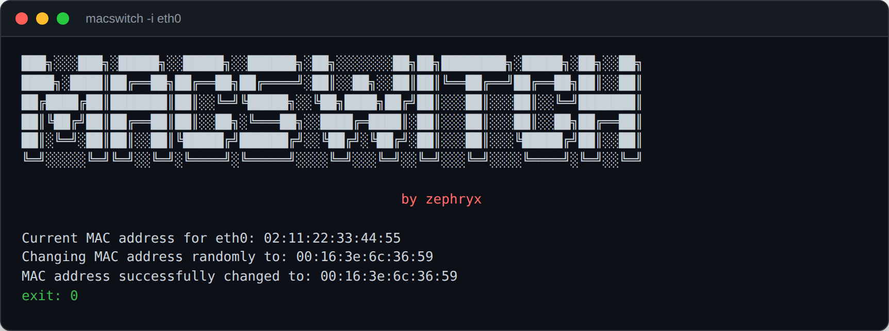
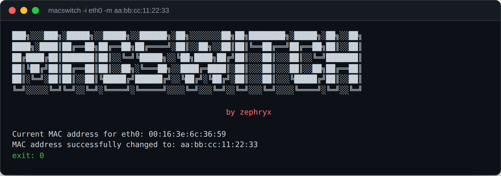
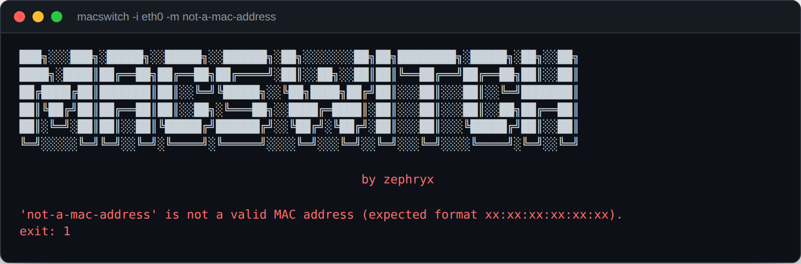
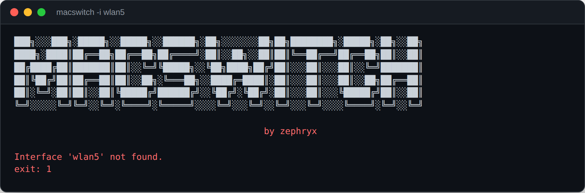

# MACSwitch
```MACSwitch``` is a versatile tool designed for changing the MAC (Media Access Control) address of network interfaces on Linux systems. Whether you're concerned about privacy, bypassing MAC address filtering, or performing network experiments, ```MACSwitch``` provides a convenient way to modify your network interface's MAC address.

## Features
- **MAC Address Randomization:** MACSwitch allows you to generate and assign random MAC addresses to your network interfaces for enhanced privacy and anonymity.
- **Custom MAC Address:** Users can specify a custom MAC address to set on their network interface, providing flexibility in MAC address configuration. The format is validated before anything touches the interface.
- **Verified Changes:** After changing the address, MACSwitch re-reads the interface and only reports success if the MAC actually changed - a failed `ifconfig` call (wrong interface, missing permissions, no `sudo`) is reported as a failure instead of silently claiming success.
- **Manual Revert:** MACSwitch prints the interface's original MAC address before changing it; re-run with `-m <that address>` to restore it.
- **Linux Support:** MACSwitch targets Linux distributions with `ifconfig`/`net-tools` installed, and exits with a clear message if either is missing.

## Screenshots

### Random MAC address, verified
No `-m` generates a random MAC and confirms it actually took effect on the interface before reporting success.


### Custom MAC address
`-m aa:bb:cc:11:22:33` sets a specific address instead.


### Invalid MAC rejected before touching the interface
A malformed `-m` value is caught by format validation instead of being handed to `ifconfig`.


### Missing interface handled cleanly
A nonexistent interface produces a clear error and a non-zero exit code instead of a raw traceback.


## Usage
To start using ```MACSwitch```, simply specify the network interface using ```-i``` or ```--interface``` and the desired MAC address using ```-m``` or ```--mac```.

## Example usage:
```
python3 macswitch.py -i <interface> -m 00:11:22:33:44:55
```
## Installation

> Clone the MACSwitch repository from GitHub:
```
git clone https://github.com/zephryx01/Mac-switch.git
```
> Navigate to the MACSwitch directory:
```
cd Mac-switch
```
> Ensure you have Python 3 installed on your system.

> Run MACSwitch using Python:
```
python3 macswitch.py -i <interface> -m 00:11:22:33:44:55
```
> To revert back to your original MAC address
```
python3 macswitch.py -i <interface> -m <original_mac_address>
```
### Contributing
Contributions to MACSwitch are welcome! If you encounter any issues or have suggestions for improvements, please open an issue on the GitHub repository.

# Disclaimer
MACSwitch is intended for educational and legal purposes only. Unauthorized use of this tool against networks or devices without proper authorization may violate local laws and regulations.

